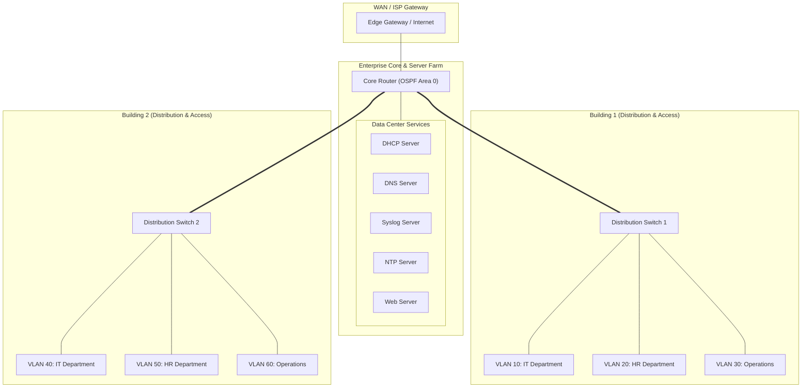

# Enterprise Network Design & CyberOps Security Architecture (5GCOM)

An enterprise-grade campus network architecture and cybersecurity implementation designed for the **5GCOM** telecommunications provider using **Cisco Packet Tracer**. The project models a resilient multi-building topology segmented across departments, incorporating dynamic OSPF routing, Inter-VLAN routing, core network services (DHCP, DNS, Syslog, NTP, Web), and switchport-level perimeter security.

---

## Features

- **Multi-Building Campus Topology**:
  - Two interconnected corporate buildings with 3 functional departmental zones each: **IT**, **Human Resources (HR)**, and **Operations**.
- **Virtual LAN (VLAN) Segmentation**:
  - Granular traffic isolation restricting broadcast domains across departments and server clusters.
- **Dynamic & Inter-VLAN Routing**:
  - **Inter-VLAN Routing**: Layer 3 gateway switching enabling controlled cross-department communication.
  - **Open Shortest Path First (OSPF)**: Dynamic interior gateway protocol providing automated metric-based path computation and fast failure recovery.
- **Enterprise Network Services**:
  - **DHCP**: Centralized dynamic IP address allocation across segmented subnets.
  - **DNS**: Internal domain name resolution for company services.
  - **Syslog**: Centralized logging server capturing system events, audit trails, and interface state transitions.
  - **NTP**: Network Time Protocol synchronization ensuring unified audit log timestamps across routers and switches.
  - **HTTP/Web Server**: Internal intranet portal hosting.
- **Security & Threat Mitigation**:
  - **Access Control Lists (ACLs)**: Standard and Extended ACLs enforcing zero-trust traffic filters between sensitive subnets (e.g., isolating HR financial data from guest/operational nodes).
  - **Switch Port Security**: MAC address binding (`switchport port-security mac-address sticky`) and violation shutdown rules mitigating rogue device access and MAC flooding attacks.
  - **Secure Management**: Encrypted SSH administrative access replacing legacy Telnet.

---

## Network Architecture Topology



---

## Configuration & Implementation Summary

| Subsystem | Implemented Protocols & Technologies | Purpose |
|---|---|---|
| Routing | OSPF (Open Shortest Path First), Inter-VLAN | Dynamic path selection and inter-subnet routing |
| Switching | 802.1Q Trunking, PortFast, Port Security | Layer 2 broadcast containment and port hardening |
| Addressing | IPv4 Subnetting, DHCP Relay / Helper Addresses | Optimized address utilization and automated client lease |
| Infrastructure Services | DNS, NTP, Syslog, HTTP | Name resolution, time synchronization, and central telemetry |
| Access Control | Extended IP Access Control Lists (ACLs) | Restricting unauthorized cross-department packet flow |
| Device Hardening | Sticky MAC, Maximum MAC limit = 1, Shutdown violation | Preventing CAM overflow and unauthorized physical port connection |

---

## Project Structure

```text
Network-Security_5GCOM-project/
├── final-11.pkt                           # Cisco Packet Tracer simulation topology and device configs
├── Final-Project 5GCOM presentation.pdf   # Architectural presentation and security review
└── README.md                              # Project documentation
```

---

## Simulation Verification & Media

Detailed topology layout and configuration verification screenshots:

- **Enterprise Topology Overview**:
  
- **Subnet & IP Configuration**:
  
- **Server Farm Services (DHCP/DNS/Syslog)**:
  
- **Switch Port Security Status**:
  
- **End-to-End Connectivity & Ping Verification**:
  

---

## How to Run the Simulation

### Prerequisites
- [Cisco Packet Tracer](https://www.netacad.com/courses/packet-tracer) (version 8.0 or newer)

### Steps
1. Clone the repository:
   ```bash
   git clone https://github.com/Eng-Ghanem/Network-Security_5GCOM-project.git
   cd Network-Security_5GCOM-project
   ```
2. Open [`final-11.pkt`](final-11.pkt) in Cisco Packet Tracer.
3. Observe real-time OSPF neighbor relationships establish across routers.
4. Test inter-VLAN ping from client terminals in Building 1 to services in the core server farm.

---

## Documentation

Full project slides and design rationale are available in [Final-Project 5GCOM presentation.pdf](Final-Project%205GCOM%20presentation.pdf).

---

## Author

- **Mohamed Ghanem** - [Eng-Ghanem](https://github.com/Eng-Ghanem)
